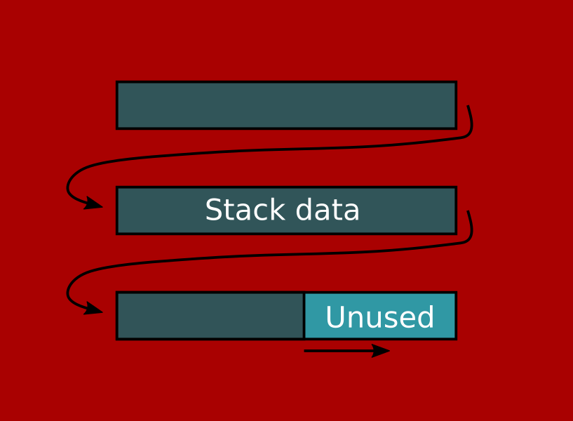

## Lost in the stacks

Go-Sheffield 09/05/2019

Alex Whitney

adwhit@fastmail.com

---

* A look at some of Go's implementation details
* Lots of people worked hard so you don't have to care about any of this
* You probably won't learn anything useful, but you might learn something interesting?

---

Disclaimers:

* I don't know Go!
* I don't know that much about system programming!
* I'm going to gloss over a lot of detail!

---

### Look at this code

```go
package main

import (
        "fmt"
        "time"
)

const hugesize = 8192
const mediumsize1 = 1024-3*128
const smallsize = 128

func huge1(i int) byte {
        var bigarr [hugesize]byte
        bigarr[i] = medium1(i)
        return bigarr[2*i]
}

func medium1(i int) byte {
        var medarr [mediumsize1]byte
        for k := 0; k < 100000000; k++ {
                medarr[i] = small(i)
        }
        return medarr[2*i]
}

func small(i int) byte {
        var smallarr [smallsize]byte
        smallarr[i] = byte(i)
        return smallarr[2*i]
}

func main() {
        t0 := time.Now()
        huge1(0)
        t1 := time.Now()
        fmt.Printf("time: %v\n", t1.Sub(t0))
}

```

```
$ go run snippet.go
time: 941.248193ms
```


----

### Look at this code also please

```go
package main

import (
        "fmt"
        "time"
)

const hugesize = 8192
const mediumsize1 = 1024-3*128
const mediumsize2 = 1024-2*128
const smallsize = 128

// part 1
func huge1(i int) byte {
        var bigarr [hugesize]byte
        bigarr[i] = medium1(i)
        return bigarr[2*i]
}

func medium1(i int) byte {
        var medarr [mediumsize1]byte
        for k := 0; k < 100000000; k++ {
                medarr[i] = small(i)
        }
        return medarr[2*i]
}

func small(i int) byte {
        var smallarr [smallsize]byte
        smallarr[i] = byte(i)
        return smallarr[2*i]
}


// part 2
func huge2(i int) byte {
        var bigarr [hugesize]byte
        bigarr[i] = medium2(i)
        return bigarr[2*i]
}

func medium2(i int) byte {
        var medarr [mediumsize2]byte
        for k := 0; k < 100000000; k++ {
                medarr[i] = small(i)
        }
        return medarr[2*i]
}

func main() {
        t0 := time.Now()
        huge1(0)
        t1 := time.Now()
        huge2(0)
        t2 := time.Now()
        fmt.Printf("  no split: %v\n", t1.Sub(t0))
        fmt.Printf("with split: %v\n", t2.Sub(t1))
}
```
```
$ go run split.go
  no split: 923.250886ms
with split: 4.083535368s   <-- ALARM
```

----

Rest of this talk: explanation

---

We are going to need a refresher on

## Processes and Memory

----

Traditional (single-threaded) view of a process:

* Initialized by the kernel
* Is given a bag of contiguous memory from a bigger bag of memory (RAM)
* Memory is split up into (at least) 3 sections
  - Code
  - Stack
  - Heap
  
----


----

## Code

* A static block of memory where the machine code of your go binary resides
* Cannot be modified, grown etc, only executed
* CPU has a register, the 'code pointer', which stores the currently-executing code location

----

## Stack

* Stores the execution state
* Rigid data structure, continually grows and shrinks (stack!) as program executes
* Stores the call stack
  - When a function B is called from function A, the location (code pointer) of function A is "pushed" to the stack
  - When function B returns, the location is "popped" of the stack so function A can continue
* Also stores data local to a given function

----

## Heap

* Just a bag of memory for whatever
* To be stored on the stack, data must be a KNOWN, FIXED size (e.g. an `int`)
* If the data is dynamically sized - for example a slice or a map - it must go on the heap
* Heap data is 'live' (i.e. in use) if a pointer to that data exists on the stack
* If the data is not live, it will eventually be garbage collected

----

### Simple example
```go
package main

import ( "fmt" )

func A(x int) map[string]int {
    // allocated on stack
	var y = 100;
    // map pointer returned to `main`
	return B(x, y)
}

func B(x int, y int) map[string]int {
    // allocated on heap, pointer held on stack
	m := make(map[string]int);
	m["x"] = x;
	m["y"] = y;
    // map pointer returned to A
	return m
}

func main() {
	amap := A(10);
	for k, v := range amap {
		fmt.Printf("Key: %s\tValue: %v\n", k, v);
	}
}
```

----


---

## Go is not C

* We don't want a single thread
* We want a lot of threads (goroutines)
* We want MILLIONS

----

### First problem

* Each thread needs its own call stack
* Where do we put these stacks?
* Dynamically-sized data structure?
* The heap of course!

----


* Runtime allocates a stack for each goroutine
* Runtime schedules the goroutines to run concurrently

----

### Next problem

* How big should each goroutine stack be?
* On linux, default stack is 8 MB
* 8 MB * 1M stacks = 8 petabytes
* Um, no
* Default stack size in Go is ~4Kb
* 1M stacks = 4GB = reasonable

----

### That doesn't sound like much

It isn't. 8MB is plenty. 4KB carries big risk of
```
Segmentation fault (core dumped)
```

---
## Solution

*Segmented Stacks*

----

### Segmented stacks

* A single stack is a *linked-list* of multiple sub-stacks
* When a particular substack is full, the runtime allocates an new substack and links them together



----

* When the stack returns from a function (unwinds), it is possible that a substack will no longer be needed
* It is *freed* and will be garbage collected
* This allows the stack to grow indefinitely


---

## Consequences

Now we can understand our test-case.

```go
package main

import (
        "fmt"
        "time"
)

const hugesize = 8192          // 8 KB
const mediumsize1 = 1024-3*128 // no split required - fast!
const mediumsize2 = 1024-2*128 // split between medium and small - slow!
const smallsize = 128

// big frame, forces start of stack
func huge1(i int) byte {
	    // allocate a large array
        var bigarr [hugesize]byte
	    // call medium1. medium1 is allocated in a new split stack
        bigarr[i] = medium1(i)
        return bigarr[2*i]
}

// medium frame, uses up most of StackExtra
func medium1(i int) byte {
     	// allocate array that takes up most of the rest of the split stack
        var medarr [mediumsize1]byte
	    // repeatedly call into small (100M times). small can use existing stack-frame: fast!
        for k := 0; k < 100000000; k++ {
                medarr[i] = small(i)
        }
        return medarr[2*i]
}

// small frame, overflows stack and forces allocation of new one
func small(i int) byte {
        var smallarr [smallsize]byte
        smallarr[i] = byte(i)
        return smallarr[2*i]
}


// same as above, slightly different medium size
func huge2(i int) byte {
        var bigarr [hugesize]byte
        bigarr[i] = medium2(i)
        return bigarr[2*i]
}

func medium2(i int) byte {
	    // allocate array that takes up *all* of new split stack
        var medarr [mediumsize2]byte
		// now the call to small causes a new split stack to be allocated: slow!
        for k := 0; k < 100000000; k++ {
                medarr[i] = small(i)
        }
        return medarr[2*i]
}


func main() {
        t0 := time.Now()
        huge1(0)
        t1 := time.Now()
        huge2(0)
        t2 := time.Now()
        fmt.Printf("  no split: %v\n", t1.Sub(t0))
        fmt.Printf("with split: %v\n", t2.Sub(t1))
}
```
----

* The pathological test was designed so that the goroutine almost fills up a substack with an array...
* Then calls into a function, causing a new substack to be allocated...
* Then it quickly returns, causing the new substack to be immediately destroyed...
* And it does this 100M times

----

That is expensive!

```
  no split: 919.613062ms
with split: 4.1413503s
```
* The first and third test cases are designed not to allocate

---

## Punchline

----

* Everything I have told you was true in Go 1.0
* Everything changed in Go 1.3
* So none of this is true, any more
* If you want to know what changed... ask me!

```
$ ./bench
Running with Go 1.1

  no split: 919.613062ms
with split: 4.1413503s

Running with Go 1.3

  no split: 669.433717ms
with split: 692.60258ms
```

---

### Sorry/Thanks!
